## **In Home**

[View the deployed project here](https://in-home-9aea5ddaebd0.herokuapp.com/)

## **Site Overview**

In Home is an online e-commerce store selling all different types of homeware. Users are able to browse and purchase homeware directly through the website, make an account to keep track of their order history, leave reviews for products they have purchased and contact the company via a contact form.

## **Table of contents**

- [**In Home**](#in-home)
- [**Site Overview**](#site-overview)
- [**Table of contents**](#table-of-contents)
- [**Planning stage**](#planning-stage)
  - [**Target Audiences**](#target-audiences)
  - [**User Stories**](#user-stories)
  - [**Site Aims**](#site-aims)
  - [**Database Schema**](#database-schema)
  - [**Wireframes**](#wireframes)
  - [**Color Scheme**](#color-scheme)
- [**Typography**](#typography)
- [**Features**](#features)
- [**Future Enhancements**](#future-enhancements)
- [**Testing Phase**](#testing-phase)
  - [**Responsiveness**](#responsiveness)
  - [**Functionality**](#functionality)
  - [**Validators**](#validators)
  - [**Lighthouse**](#lighthouse)
  - [**Testing user stories**](#testing-user-stories)
- [**Bugs**](#bugs)
- [**Deployment**](#deployment)
- [**Tech**](#tech)
- [**Credits**](#credits)
  - [**Honourable mentions**](#honourable-mentions)
  - [**Content**](#content)
  - [**Media**](#media)

## **Planning stage**

### **Target Audiences**

- Users in need of homeware for their new home
- Users in need of homeware to refurbish their home
- Users in need of homeware as a gift for a friend or relative
- Users in need of homeware for an office or workplace (kitchen appliances etc)

### **User Stories**

As a new user, I want to:

- Immediately understand the site's purpose
- Easily navigate the website
- Browse all available products
- Filter products to quickly find what I need
- Search for products
- Contact the company for help or advice
- Purchase products without registering for an account
- Browse reviews left by other users
- Stay informed on actions I take throughout the website
- Receive confirmation of my order
- Access the site on any device
- Create and log into an account

As a registered user, I want to:

- View my profile page
- View my previous order history
- View and update my personal information
- Create reviews for products I've purchased
- View reviews for products I've purchased
- Update reviews for products I've purchased
- Delete reviews for products I've purchased
- Change my password
- Make purchases without filling in my personal information each time
- Logout of my account

As an admin, I want to:

- Add new products to the store
- Update existing products
- Delete existing products
- Delete existing reviews
- Easily access admin controls

### **Site Aims**

- Offer a simple and responsive e-commerce store where users can purchase homeware items quickly and easily.
- Offer the ability to register an account, allowing the user to see their previous order history, manage personal information and leave reviews for products they have purchased.
- To keep the user informed as they nagivate the store, providing confirmation of successful actions taking and warning them when something hasn't worked the way they would expect.
- To allow the user the ability to message the store via a contact form if they need help or advice.

### **Database Schema**

-

### **Wireframes**

The original wireframes for the main pages of the store can be found below. During development, a few decisions were made to change the original structure.

- Home Page: The welcome heading and text was moved into the main image underneath the navigation to give this area more substance and make it one of the first things the user can see upon entering the store.
- Product Detail Page: Instead of using Bootstrap cards to display existing review, I opted to use the Bootstrap accordion instead as the cards would be quite big, and also I could incorporate the stores color theme into the accordion in a more aesthetic way than a card. I felt the overall flow of the page was better as a result.
- Contact Page: A few minor label changes for the input fields, plus the addition of the company contact details should the user wish to contact them by phone, email or visit directly. These details are already in the footer, however as one of the essential pieces of information if a user needs help or advice, I felt it was a good idea to include it on the contact page as well.

 

Home Page

 
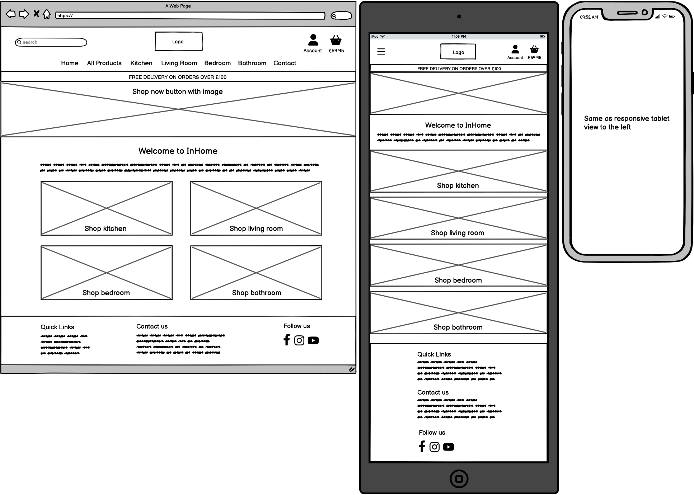

 

Profile Page

 
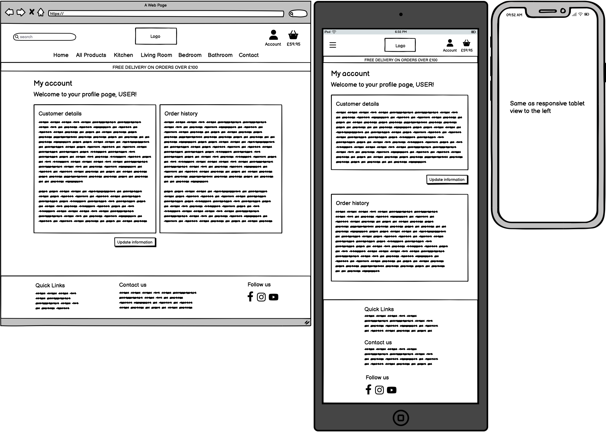

 

Contact Page

 
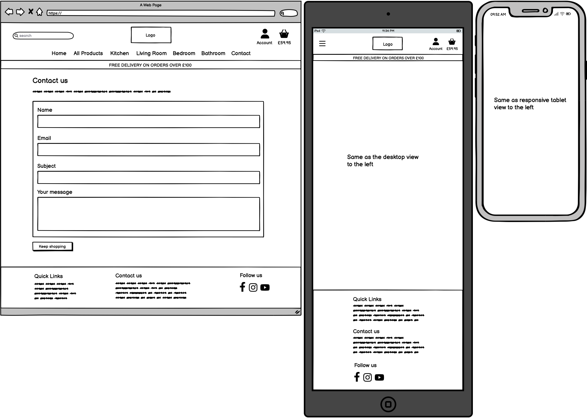

 

Products Page

 
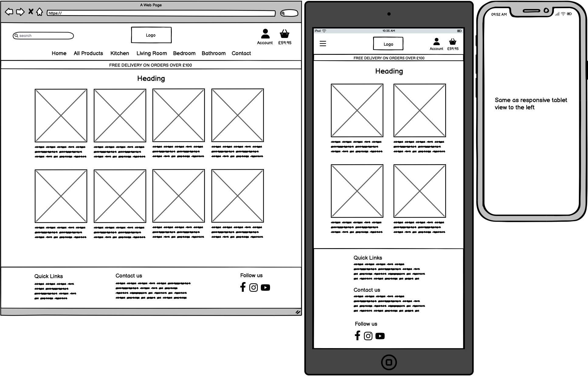

 

Product Detail Page

 
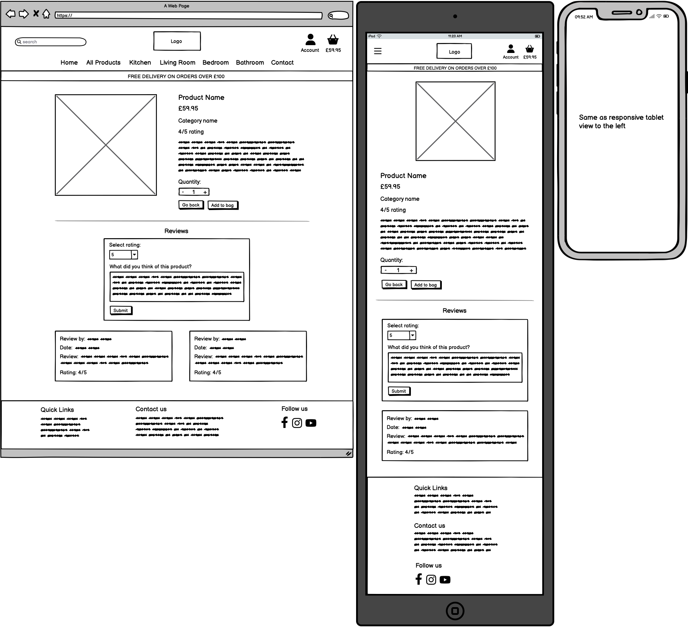

 

Shopping Bag

 
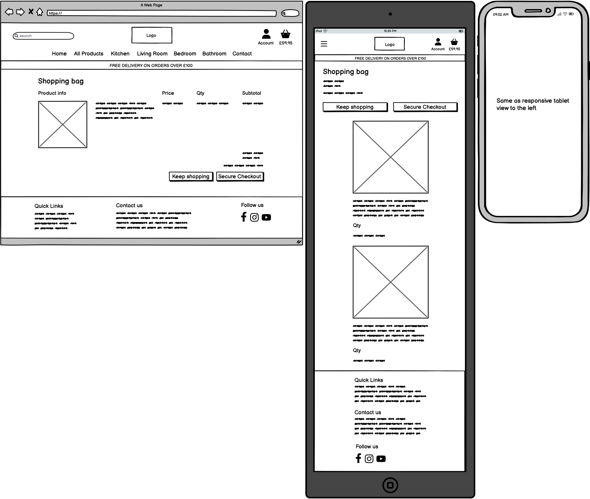

 

Checkout Page

 
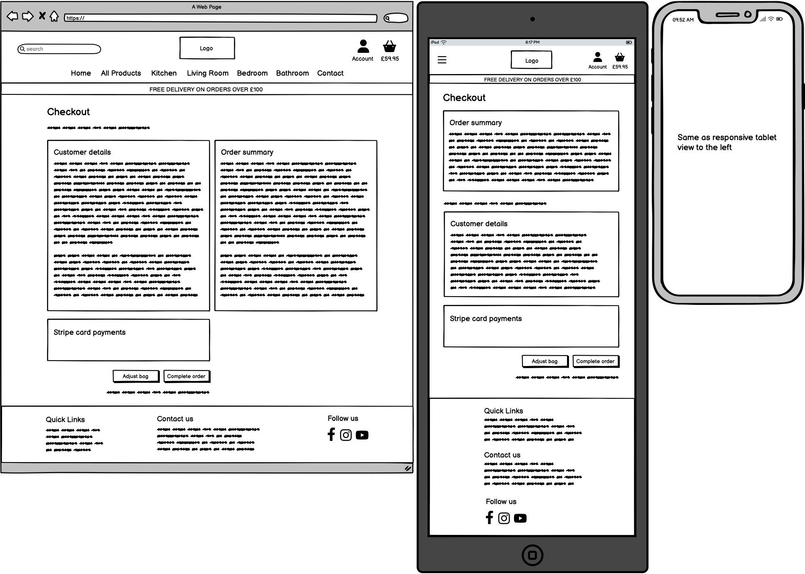

 

Order Confirmation Page

 
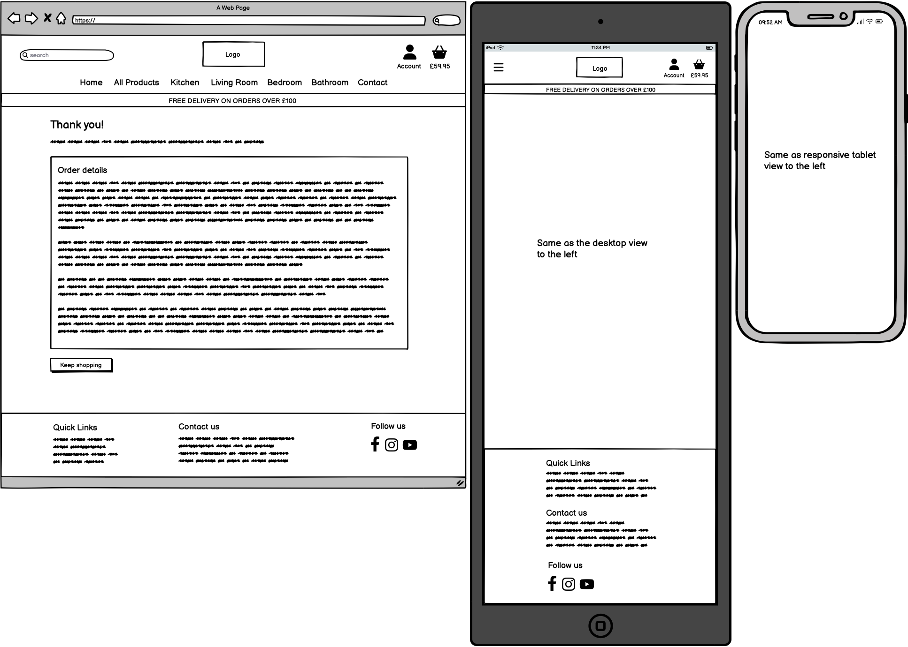

### **Color Scheme**

- Navy: #0D1B2A
- Blue: #415A77
- Black: #000
- White: #fff
- Grey: #d5d5d5 (used when hovering navigation links)

The [WCAG Color Contrast Checker](https://accessibleweb.com/color-contrast-checker/) was used to ensure that any navy/blue and white/grey combinations were suitable for use. All results passed except the small text in the AAA test for the blue/grey combination, however after a discussion with my mentor we agreed this was OK as the criteria for the AAA testing is incredibly high and almost never passes.

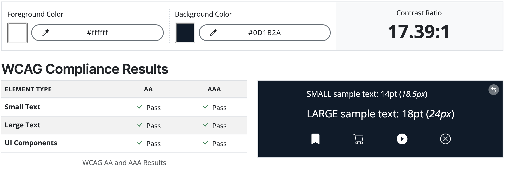

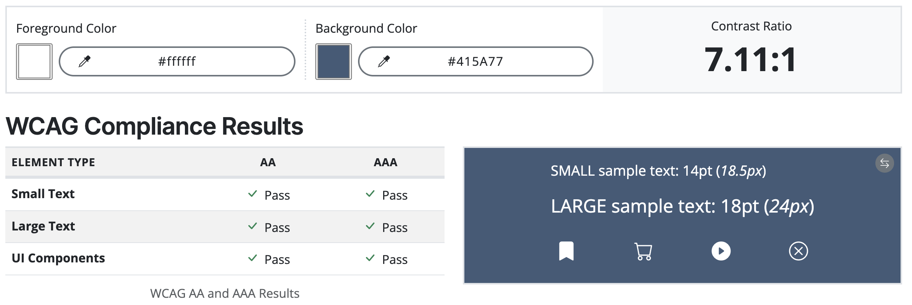

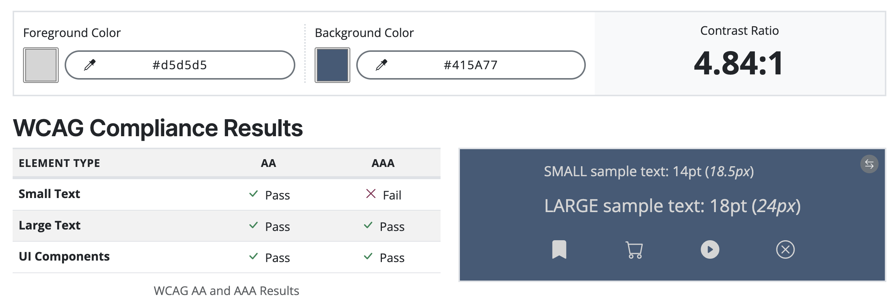

## **Typography**

I decided to import and use the Outfit font using Google Fonts for the store, with Helvetica and sans-serif acting as the back up fonts should the Outfit import fail.

I wanted to choose a font which wasn't mainstream and unique, but also smart and representative of the profesional yet fun nature of the store. It worked well with lowercase and uppercase letters, special characters and numbers when tested on the Google platform prior to importing.

## **Features**

**Features common to all pages**

## **Future Enhancements**

Some possible enhancements which could be applied in the future include:

- A section in the users profile which displays any previous reviews they have left for products, with the option to update or delete them directly from their profile.
- A featured product section above the footer which shows on any page of the site, so the store can promote the most popular products, or products they wish to push at any given time.
- A social account login feature, so the user can login to the website using their social media account rather than an email
- A special offers section for any discounted products or special deals available
- A 'You may also like...' section at the bottom of each product which shows products the user may be interested in based on what they are currently viewing
- A 'Suggested for you' section on the users profile page which suggests products they may wish to purchase based on thier previous order history
- A newsletter signup, so the store can market their products and special offers directly to interested users.

## **Testing Phase**

### **Responsiveness**

Responsiveness was checked and worked as intended with the following browsers and screen sizes:

- Extra Large (27" Mac Desktop):

  - Chrome (Version )
  - Safari (Version )
  - Firefox (Version )

- Large (15" MacBook Pro Laptop):

  - Chrome (Version )
  - Firefox (Version )
  - Safari (Version )

- Medium (10.9" iPad):

  - Chrome
  - Safari
  - Firefox

- Small (6" iPhone 13):

  - Chrome (Version )
  - Safari
  - Firefox (Version )

DevTools was also used to check the responsiveness at various screen sizes and devices from the list of devices available. All were fully responsive and caused no issues, including the smallest device available in the list which was a Galaxy Z Fold 5.

### **Functionality**

Manual testing as a logged **OUT** user

Feature/Test                                                                       | Expected Outcome.                                                                                                                                                  | Result |
| -------------------------------------------------------------------------------- | ------------------------------------------------------------------------------------------------------------------------------------------------------------------ | ------ |
|                                                                     |                                                                                                                |   |

Manual testing as a logged **IN** user

Feature/Test                                                                       | Expected Outcome.                                                                                                               | Result |
| -------------------------------------------------------------------------------- | ------------------------------------------------------------------------------------------------------------------------------- | ------ |
|                                            |                                                                       |   |

### **Validators**

**HTML Validators**

Home Page

 

 

**CSS Validator**

**JS Hint**

**CI Python Linter**

### **Lighthouse**

### **Testing user stories**

**User story 1**: As a user, I want the site to be easy to use.

**Achieved?**: Yes. The application includes features and instructions which are clear to the user as they progress through the website.

## **Bugs**

I found the following bugs during the development process:

- Toasts
  - Problem: Toast messages not showing when user takes an action which should display a message.
  - Cause: Jquery doesn't recognise the toast() function based on the Bootstrap version being used
  - Solution: Replaced it with vanilla javascript which worked with the Bootstrap version being used

- Sort by rating
  - Problem: When choosing to sort by high to low rating, the order is not correct and highest rated products are not showing first
  - Cause: 
  - Solution: 

  - Mobile search bar
  - Problem: Mobile search bar is overlapping content below when it appears, rather than pushing everything down.
  - Cause: 
  - Solution: 

---

## **Deployment**

## **Tech**

Languages used:

- HTML
- CSS
- JavaScript
- Python

Framework used:

- Django

Tools used:

- Bootstrap
- Fontawesome
- Google Fonts
- Stripe
- Amazon Web Services
- CI Database

Deployment:

- Heroku

Version Control:

- Git & Github

## **Credits**

The following people, websites and learning materials aided me with the creation of this project.

### **Honourable mentions**

Special thanks to my mentor Richard Wells for his excellent advice and support throughout this project.

### **Content**

### **Media**

Product images were sourced using the free image sites [Unsplash](https://unsplash.com/), [Free Images](https://www.freeimages.com/) and [Pexels](https://www.pexels.com/).

I designed the In Home logo myself using my own Adobe software.