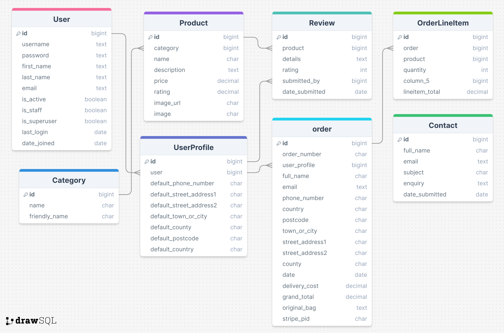

## **In Home**

[View the deployed project here](https://in-home-9aea5ddaebd0.herokuapp.com/)

## **Site Overview**

In Home is an online e-commerce store selling all different types of homeware. Users are able to browse and purchase homeware directly through the website, make an account to keep track of their order history, leave reviews for products they have purchased and contact the company via a contact form.

## **Table of contents**

- [**In Home**](#in-home)
- [**Site Overview**](#site-overview)
- [**Table of contents**](#table-of-contents)
- [**Planning stage**](#planning-stage)
  - [**Target Audiences**](#target-audiences)
  - [**User Stories**](#user-stories)
  - [**Site Aims**](#site-aims)
  - [**Database Schema**](#database-schema)
  - [**Wireframes**](#wireframes)
  - [**Color Scheme**](#color-scheme)
- [**Typography**](#typography)
- [**Features**](#features)
- [**Future Enhancements**](#future-enhancements)
- [**Testing Phase**](#testing-phase)
  - [**Responsiveness**](#responsiveness)
  - [**Functionality**](#functionality)
  - [**Validators**](#validators)
  - [**Lighthouse**](#lighthouse)
  - [**Testing user stories**](#testing-user-stories)
- [**Bugs**](#bugs)
- [**Deployment**](#deployment)
- [**Tech**](#tech)
- [**Credits**](#credits)
  - [**Honourable mentions**](#honourable-mentions)
  - [**Content**](#content)
  - [**Media**](#media)

## **Planning stage**

### **Target Audiences**

- Users in need of homeware for their new home
- Users in need of homeware to refurbish their home
- Users in need of homeware as a gift for a friend or relative
- Users in need of homeware for an office or workplace (kitchen appliances etc)

### **User Stories**

**As a new user, I want to:**

1. Immediately understand the site's purpose
2. Easily navigate the website
3. Browse all available products
4. Filter products to quickly find what I need
5. Search for products
6. Contact the company for help or advice
7. Purchase products without registering for an account
8. Browse product reviews left by other users
9. Stay informed on actions I take throughout the website
10. Receive confirmation of my order
11. Access the site on any device
12. Create and log into an account

**As a registered user, I want to:**

13. View my profile page
14. View my previous order history
15. View and update my personal information
16. Create reviews for products I've purchased
17. View reviews for products I've purchased
18. Update reviews for products I've purchased
19. Delete reviews for products I've purchased
20. Change my password
21. Make purchases without filling in my personal information each time
22. Logout of my account

**As an admin, I want to:**

23. Add new products to the store
24. Update existing products
25. Delete existing products
26. Delete existing reviews

### **Site Aims**

- Offer a simple and responsive e-commerce store where users can purchase homeware items quickly and easily.
- Offer the ability to register an account, allowing the user to see their previous order history, manage personal information and leave reviews for products they have purchased.
- To keep the user informed as they nagivate the store, providing confirmation of successful actions taking and warning them when something hasn't worked the way they would expect.
- To allow the user the ability to message the store via a contact form if they need help or advice.

### **Database Schema**

Many thanks to [Draw SQL](https://drawsql.app/) for assisting me with my database schema. This really helped me to visualise how the tables would be set up and where each table connects.

### **Wireframes**

The original wireframes for the main pages of the store can be found below. During development, a few decisions were made to change the original structure.

- Home Page: The welcome heading and text was moved into the main image underneath the navigation to give this area more substance and make it one of the first things the user can see upon entering the store.
- Product Detail Page: Instead of using Bootstrap cards to display existing review, I opted to use the Bootstrap accordion instead as the cards would be quite big, and also I could incorporate the stores color theme into the accordion in a more aesthetic way than a card. I felt the overall flow of the page was better as a result.
- Contact Page: A few minor label changes for the input fields, plus the addition of the company contact details should the user wish to contact them by phone, email or visit directly. These details are already in the footer, however as one of the essential pieces of information if a user needs help or advice, I felt it was a good idea to include it on the contact page as well.

 

Home Page

 

 

Profile Page

 

 

Contact Page

 

 

Products Page

 

 

Product Detail Page

 

 

Shopping Bag

 

 

Checkout Page

 

 

Order Confirmation Page

 

### **Color Scheme**

- Navy: #0D1B2A
- Blue: #415A77
- Black: #000
- White: #fff
- Grey: #d5d5d5 (used when hovering navigation links)

The [WCAG Color Contrast Checker](https://accessibleweb.com/color-contrast-checker/) was used to ensure that any navy/blue and white/grey combinations were suitable for use. All results passed except the small text in the AAA test for the blue/grey combination, however after a discussion with my mentor we agreed this was OK as the criteria for the AAA testing is incredibly high and almost never passes.

## **Typography**

I decided to import and use the Outfit font using Google Fonts for the store, with Helvetica and sans-serif acting as the back up fonts should the Outfit import fail.

I wanted to choose a font which wasn't mainstream and unique, but also smart and representative of the profesional yet fun nature of the store. It worked well with lowercase and uppercase letters, special characters and numbers when tested on the Google platform prior to importing.

## **Features**

**Features common to all pages**

## **Future Enhancements**

Some possible enhancements which could be applied in the future include:

- A section in the users profile which displays any previous reviews they have left for products, with the option to update or delete them directly from their profile.
- A featured product section above the footer which shows on any page of the site, so the store can promote the most popular products, or products they wish to push at any given time.
- A social account login feature, so the user can login to the website using their social media account rather than an email
- A special offers section for any discounted products or special deals available
- A 'You may also like...' section at the bottom of each product which shows products the user may be interested in based on what they are currently viewing
- A 'Suggested for you' section on the users profile page which suggests products they may wish to purchase based on thier previous order history
- A newsletter signup, so the store can market their products and special offers directly to interested users.

## **Testing Phase**

### **Responsiveness**

Responsiveness was checked and worked as intended with the following browsers and screen sizes:

- Extra Large (27" Mac Desktop):

  - Chrome (Version )
  - Safari (Version )
  - Firefox (Version )

- Large (15" MacBook Pro Laptop):

  - Chrome (Version )
  - Firefox (Version )
  - Safari (Version )

- Medium (10.9" iPad):

  - Chrome
  - Safari
  - Firefox

- Small (6" iPhone 13):

  - Chrome (Version )
  - Safari
  - Firefox (Version )

DevTools was also used to check the responsiveness at various screen sizes and devices from the list of devices available. All were fully responsive and caused no issues, including the smallest device available in the list which was a Galaxy Z Fold 5.

### **Functionality**

Manual testing as a logged **OUT** user

Feature/Test                                                                       | Expected Outcome.                                                                                                                                                  | Result |
| -------------------------------------------------------------------------------- | ------------------------------------------------------------------------------------------------------------------------------------------------------------------ | ------ |
|                                                                     |                                                                                                                |   |

Manual testing as a logged **IN** user

Feature/Test                                                                       | Expected Outcome.                                                                                                               | Result |
| -------------------------------------------------------------------------------- | ------------------------------------------------------------------------------------------------------------------------------- | ------ |
|                                            |                                                                       |   |

### **Validators**

**HTML Validators**

Home Page

 

 

**CSS Validator**

**JS Hint**

**CI Python Linter**

### **Lighthouse**

### **Testing user stories**

**User story 1**: As a new user, I want to immediately understand the site's purpose.

**Achieved?**: Yes. Upon entering the site, you are greeted with a welcome message summarising what the store sells along with a prompt to start shopping. The logo has also been designed to make it as clear as possible what the store is about, which is shown on every page of the site.

**User story 2**: As a new user, I want to easily navigate the website.

**Achieved?**: Yes. The navigation bar includes links to all pages on both desktop and mobile devices, so users are able to find what they need quickly and easily.

**User story 3**: As a new user, I want to browse all available products.

**Achieved?**: Yes. The store includes an 'All Products' section where they can view all available products, which is accessible on all devices. Browsing is made easier with options to sort by various different parameters.

**User story 4**: As a new user, I want to filter products to quickly find what I need.

**Achieved?**: Yes. Users are able to shop by category so they are able to find what they are looking for quickly and easily. 

**User story 5**: As a new user, I want to search for products

**Achieved?**: Yes. Users can search for products on all devices by using the search bar, which returns results quickly based on their input.

**User story 6**: As a new user, I want to contact the company for help or advice

**Achieved?**: Yes. The site includes a contact page where the user can submit an enquiry form to receive a response from the store. Contact details are also included, if they wish to contact the company directly themselves for an even faster response.

**User story 7**: As a new user, I want to purchase products without registering for an account

**Achieved?**: Yes. Users are able to place orders without having to register for an account.

**User story 8**: As a new user, I want to browse product reviews left by other users

**Achieved?**: Yes. Users are able to view product reviews without an account via the product detail page for the product they are interested in.

**User story 9**: As a new user, I want to stay informed on actions I take throughout the website

**Achieved?**: Yes. The user is kept informed as to whether their actions were successful or not via the messages that appear at the top right corner of the screen. Confirmation messages are included for all important actions, including adding items to the bag, placing orders and logging in or out (to name a few).

**User story 10**: As a new user, I want to receive confirmation of my order

**Achieved?**: Yes. Once an order is placed, the user is directed to a confirmation page telling them their order has been successfully placed. They will also receive an email with confirmation of their order.

**User story 11**: As a new user, I want to access the site on any device

**Achieved?**: Yes. The site is fully responsive and can be accessed on any device. In addition to testing the site on multiple devices with different screen sizes, the site was also tested using devtools with the smallest mobile device available in the list, the Galaxy Z Fold 5.

**User story 12**: As a new user, I want to create and log into an account

**Achieved?**: Yes. Users are able to create / login to their account via the 'My Account' button at the top of the screen, available on every page of the website. In addition, there are several prompts to either create and account or login to an existing account throughout the website on specific pages where relevant.

**User story 13**: As a registered user, I want to view my profile page

**Achieved?**: Yes. All registered users are provided with a profile page which can be viewed when they login.

**User story 14**: As a registered user, I want to view my previous order history

**Achieved?**: Yes. The user is able to see their previous order history on their profile page.

**User story 15**: As a registered user, I want to view and update my personal information

**Achieved?**: Yes. The user is able to view and update their personal information on their profile page.

**User story 16**: As a registered user, I want to create reviews for products I've purchased

**Achieved?**: Yes. Once logged in, users are able to create reviews for any product found within the store at the bottom of the product detail page for the product they are viewing.

**User story 17**: As a registered user, I want to view reviews for products I've purchased

**Achieved?**: Yes. Users are able to view reviews submitted by themselves or other users for any product found within the store at the bottom of the product detail page for the product they are viewing.

**User story 18**: As a registered user, I want to update reviews for products I've purchased

**Achieved?**: Yes. Users can update their existing reviews by submitting a new review for the same product as the existing review, which will overwrite / update it.

**User story 19**: As a registered user, I want to delete reviews for products I've purchased

**Achieved?**: Yes. Users can delete their existing reviews by clicking the delete button found within the review of the product they have submitted the review for.

**User story 20**: As a registered user, I want to change my password

**Achieved?**: Yes. Users can update their password via the profile page, or if they have forgotton it they can click the forgotton password link on the login page to reset it.

**User story 21**: As a registered user, I want to make purchases without filling in my personal information each time

**Achieved?**: Yes. Users are given the option to save their personal information in the checkout when completing an order, so it's saved to their profile and will be automatically filled in next time they order. They can also go to their profile and enter / update their information.

**User story 22**: As a registered user, I want to logout of my account

**Achieved?**: Yes. Users can logout of their account by clicking the logout button within the my account section at the top of the page.

**User story 23**: As an admin, I want to add new products to the store

**Achieved?**: Yes. Admin users are able to add new products to the store via the 'Add a product' button within the 'My Account' tab at the top of the page.

**User story 24**: As an admin, I want to update existing products

**Achieved?**: Yes. Admin users are able to update existing products via the 'Edit' button found on the product details page for the product to be editted.

**User story 25**: As an admin, I want to delete existing products

**Achieved?**: Yes. Admin users are able to delete existing products via the 'Delete' button found on the product details page for the product to be deleted.

**User story 26**: As an admin, I want to delete existing reviews

**Achieved?**: Yes. Admin users are able to delete existing reviews that belong to any user via the 'Delete Review' button found within the review itself on the product detail page.

## **Bugs**

I found the following bugs during the development process:

- Toasts
  - Problem: Toast messages not showing when user takes an action which should display a message.
  - Cause: Jquery doesn't recognise the toast() function based on the Bootstrap version being used
  - Solution: Replaced it with vanilla javascript which worked with the Bootstrap version being used

- Sort by rating
  - Problem: When choosing to sort by high to low rating, the order is not correct and highest rated products are not showing first
  - Cause: 
  - Solution: 

- Mobile search bar
  - Problem: Mobile search bar is overlapping content below when it appears, rather than pushing everything down.
  - Cause: 
  - Solution: 

- Dropdown with no arrow
  - Problem: Country inputs on profile and checkout page, plus the category choice on add and edit product page do not include an arrow to show they are a dropdown.
  - Cause: 
  - Solution: 

---

## **Deployment**

## **Tech**

Languages used:

- HTML
- CSS
- JavaScript
- Python

Framework used:

- Django

Tools used:

- Bootstrap
- Fontawesome
- Google Fonts
- Stripe
- Amazon Web Services
- CI Database

Deployment:

- Heroku

Version Control:

- Git & Github

## **Credits**

The following people, websites and learning materials aided me with the creation of this project.

### **Honourable mentions**

Special thanks to my mentor Richard Wells for his excellent advice and support throughout this project.

### **Content**

### **Media**

Product images were sourced using the free image sites [Unsplash](https://unsplash.com/), [Free Images](https://www.freeimages.com/) and [Pexels](https://www.pexels.com/).

I designed the In Home logo myself using my own Adobe software.